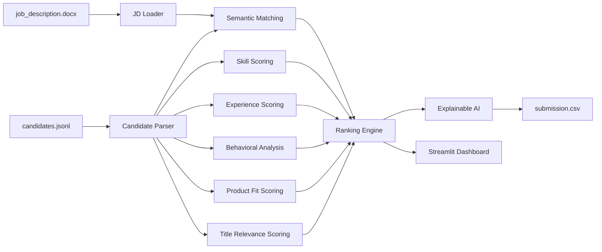
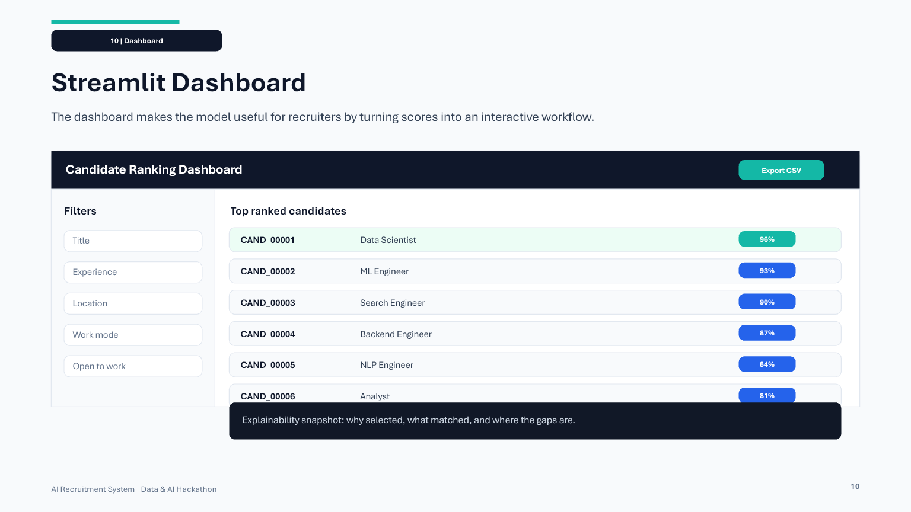
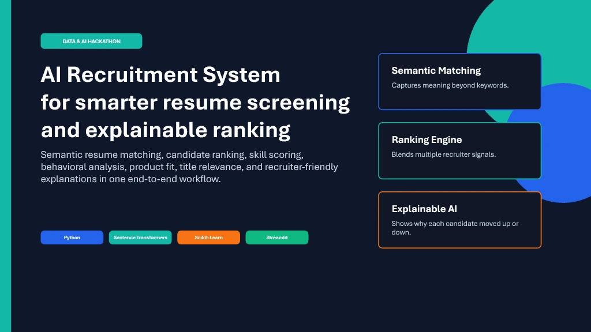

# AI Recruitment System

An explainable, production-ready AI recruitment pipeline for ranking candidates against a job description using semantic similarity, structured scoring, and recruiter-friendly reasoning.

This project combines resume parsing, semantic matching, modular scoring, ranking, explainability, and a Streamlit dashboard into one end-to-end workflow designed for large candidate datasets.

## Project Overview

The system processes candidate profiles from `data/candidates.jsonl` and a job description from `data/job_description.docx`, then scores each candidate across multiple dimensions:

- Semantic Resume Matching
- Skill Matching
- Experience Scoring
- Behavioral Analysis
- Product Fit Scoring
- Title Relevance Scoring
- Explainable AI
- Candidate Ranking

The final output is a ranked `submission.csv` file with both numeric scores and human-readable reasoning for every candidate.

## Architecture



### How it works

- `pipeline.py` loads candidates and the job description, runs all scoring modules, ranks the results, and writes the final CSV.
- `src/semantic_matcher.py` computes semantic similarity using embeddings when available, with a lightweight fallback path for local execution.
- `src/skill_matcher.py`, `src/experience_scorer.py`, `src/behavioral_scorer.py`, `src/product_fit.py`, and `src/title_scorer.py` generate component-level scores.
- `src/ranking_engine.py` combines the scores into a weighted final score.
- `src/explainability.py` generates recruiter-friendly explanations for why a candidate was selected or not selected.
- `app.py` provides an interactive Streamlit dashboard for exploration and review.

## Installation

### Requirements

- Python 3.10 or newer
- A virtual environment is recommended

### Setup

```bash
python -m venv .venv
.venv\Scripts\activate
pip install -r requirements.txt
```

If you are on macOS or Linux, activate the environment with:

```bash
source .venv/bin/activate
```

## Usage

### 1. Run the production pipeline

```bash
python pipeline.py --input data/candidates.jsonl --jd data/job_description.docx --output submission.csv
```

Optional flags:

- `--chunk-size` controls batch size for large datasets
- `--limit` is useful for quick validation runs
- `--device cpu|cuda|auto` selects the compute target
- `--log-level INFO|DEBUG|WARNING|ERROR|CRITICAL` controls logging

### 2. Launch the Streamlit dashboard

```bash
streamlit run app.py
```

### 3. Inspect the output

The pipeline generates a ranked CSV with the following columns:

| Column | Description |
|---|---|
| `candidate_id` | Unique candidate identifier |
| `rank` | Final rank after sorting by score |
| `final_score` | Weighted aggregate score |
| `semantic_score` | Job-description similarity score |
| `skill_score` | Skill match score |
| `behavior_score` | Behavioral signal score |
| `experience_score` | Relevant experience score |
| `product_fit_score` | Domain and product alignment score |
| `title_score` | Current title relevance score |
| `reasoning` | Recruiter-friendly explanation text |

## Folder Structure

```text
AI_Recruitment_System/
|-- app.py                  # Streamlit dashboard
|-- main.py                 # Alternate entry point / demo script
|-- pipeline.py             # Production scoring and ranking pipeline
|-- requirements.txt        # Python dependencies
|-- data/
|   |-- candidates.jsonl
|   |-- job_description.docx
|   |-- sample_submission.csv
|   `-- candidate_schema.json
|-- src/
|   |-- semantic_matcher.py
|   |-- skill_matcher.py
|   |-- experience_scorer.py
|   |-- behavioral_scorer.py
|   |-- product_fit.py
|   |-- title_scorer.py
|   |-- ranking_engine.py
|   |-- explainability.py
|   |-- reasoning_generator.py
|   `-- parser.py
|-- outputs/
|   `-- ai_recruitment_hackathon_presentation.pptx
|-- preview/
|   |-- slide-01.png
|   |-- slide-10.png
|   `-- deck-montage.webp
`-- submission.csv         # Generated ranking output
```

## Screenshots

Project visuals are included below. If you want to showcase the live dashboard, replace or extend these images with fresh Streamlit captures.






## Future Enhancements

- Add feedback loops for recruiter review and active learning
- Support PDF, DOCX, and LinkedIn-style resume ingestion at scale
- Add fairness, bias, and calibration checks across ranking signals
- Introduce role-specific weighting profiles for different hiring teams
- Persist candidate embeddings for faster repeated searches
- Deploy the dashboard and pipeline to a cloud environment
- Add interview recommendation and shortlist export workflows

## Notes

- The pipeline is optimized for large datasets through chunked processing and batched semantic scoring.
- The explainability layer is designed for recruiter use, not just model debugging.
- The project is structured to support both hackathon demos and production-style execution.
